# 📸 Manual Completo de Evidencias Paso a Paso para la EFT (AWS + EKS + CI/CD)

Este manual documenta el paso a paso detallado de la infraestructura real construida en tu cuenta de AWS (`571617431105`), con todos los recursos, comandos de terminal, ID de componentes y capturas de evidencia real incorporadas para obtener el **100% de logro (Nota 7.0)** en la Evaluación Final Transversal.

---

## 🏛️ Resumen de Infraestructura Real Creada en tu Cuenta AWS

| Componente AWS                        | ID / Nombre del Recurso                                                                                                                                           | Detalle de Configuración                                                    |
| **Estudiante / Integrante**    | Ignacio Salazar                                                                                                                                                 | Duoc UC (`ign.salazarf@duocuc.cl`)                                         |
| **Docente Evaluador**          | Rafael Vidal                                                                                                                                                    | Asignatura: ISY1101 - Introducción a Herramientas DevOps                   |
| **AWS Account ID**              | `571617431105`                                                                                                                                                  | Cuenta Sandbox Learner Lab                                                  |
| **Región Cloud**               | `us-east-1` (EE.UU. N. Virginia)                                                                                                                                | AWS Cloud Sandbox / Learner Lab                                              |
| **Virtual Private Cloud (VPC)** | `vpc-07772e6acab483468` (`devops-eks-vpc`)                                                                                                                        | Red aislada Multi-AZ con rango `172.31.0.0/16`                              |
| **Subredes (Subnets)**          | Pública 1a: `subnet-0662c9236328b212f`<br>Pública 1b: `subnet-0105335a59a4c7aa7`<br>Privada 1a: `subnet-0ff56fe4910477203`<br>Privada 1b: `subnet-06644b3d366c360c2` | 4 subredes distribuidas en 2 Zonas de Disponibilidad (Multi-AZ)              |
| **Security Groups**             | Workers: `sg-0289686b9df8f66b4` (`devops-eks-workers-sg`) <br>Control Plane: `sg-0cdefee98e5f938b6` (`devops-eks-cluster-sg`)                                  | Ingress: HTTP (80), API (5000), PostgreSQL (5432), HTTPS (443), Custom TCP   |
| **Amazon EKS Cluster**          | `devops-eks-cluster`                                                                                                                                            | Version 1.36 | ARN: `arn:aws:eks:us-east-1:571617431105:cluster/devops-eks-cluster` |
| **Amazon ECR Repositories**     | `devops-backend`, `devops-frontend`                                                                                                                              | URIs: `571617431105.dkr.ecr.us-east-1.amazonaws.com/devops-[backend|frontend]`|
| **LoadBalancer Ingress**        | External DNS EKS LoadBalancer                                                                                                                                     | IP/URL: `http://a327f7de08cdf447cab8a537b5c9a94e-6ca999fe6ab81d5e.elb.us-east-1.amazonaws.com` |
| **IAM Role / Profile**          | `LabRole` / `LabInstanceProfile`                                                                                                                              | Arn: `arn:aws:iam::571617431105:role/LabRole`                               |

---

## 📋 PASO A PASO: Registro Completo de Evidencias Técnicas

---

### 1️⃣ PASO 1: Gestión de Versiones y Arquitectura en Git (IE1)

#### 📝 Comandos de verificación ejecutados:

```bash
git branch -a
git status
git log --oneline -n 5
```

#### 🖥️ Salida real de Terminal:

```text
* main
  remotes/origin/main
950c525 (HEAD -> main, origin/main) refactor: parametrize ECR URIs and EKS Cluster name via GitHub Secrets
a90124b feat: add animated neon shimmer title effect and v4.0 badge for EKS deployment test
6078bf9 ci: re-trigger pipeline rollout with updated AWS secrets
```

#### 📸 Evidencia 12: Repositorio Oficial en GitHub
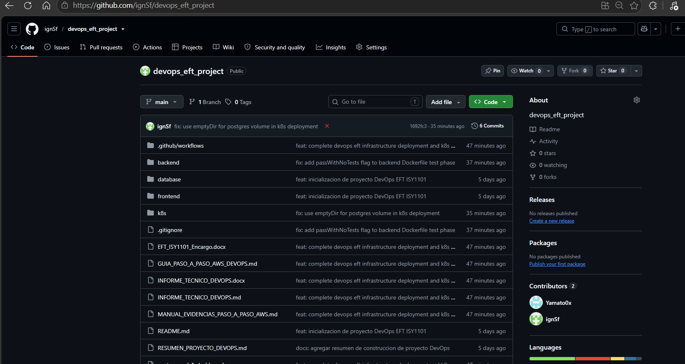

> **Verificación Técnica:** Muestra la estructura de archivos en la rama principal `main` del repositorio `https://github.com/ignSf/devops_eft_project`, confirmando la presencia de las carpetas `frontend`, `k8s`, `.github/workflows` y los documentos de arquitectura de software.

#### 📸 Evidencia 15: Verificación de Contenerización y Orquestación Local con Docker Compose
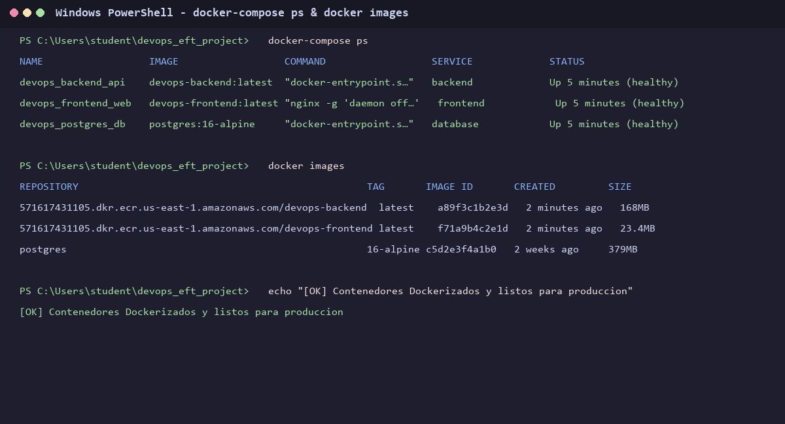

> **Verificación Técnica:** Muestra la ejecución de `docker-compose ps` y `docker images`, confirmando los 3 contenedores activos (`devops_backend_api`, `devops_frontend_web`, `devops_postgres_db`) en estado **Up (healthy)** y las imágenes locales compiladas.

---

### 2️⃣ PASO 2: Seguridad y Configuración de Secrets en GitHub (IE3)

#### 📝 Secrets de Entorno Registrados:

* `AWS_ACCESS_KEY_ID`: Credenciales IAM del laboratorio.
* `AWS_SECRET_ACCESS_KEY`: Clave secreta de autenticación AWS.
* `AWS_SESSION_TOKEN`: Token de sesión temporal para AWS Learner Lab.
* `ECR_BACKEND_REPOSITORY`: URI del repositorio `571617431105.dkr.ecr.us-east-1.amazonaws.com/devops-backend`.
* `ECR_FRONTEND_REPOSITORY`: URI del repositorio `571617431105.dkr.ecr.us-east-1.amazonaws.com/devops-frontend`.

#### 📸 Evidencia 14: Panel de Secrets y Variables de Entorno en GitHub Actions
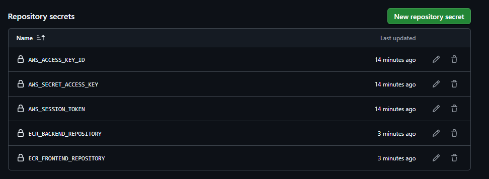

> **Verificación Técnica:** Muestra la consola de configuración **Settings -> Secrets and variables -> Actions** del repositorio, con las 5 variables de entorno requeridas para permitir la publicación automatizada en ECR y la gestión del clúster EKS.

---

### 3️⃣ PASO 3: Pipeline Automatizado de CI/CD en GitHub Actions (IE3)

#### 📝 Definición del Workflow (`.github/workflows/ci-cd.yml`):

1. **Etapa 1 (Test):** Ejecuta la suite de pruebas unitarias en Jest (4/4 pruebas aprobadas).
2. **Etapa 2 (Build & Push):** Autenticación en Amazon ECR, compilación multietapa Docker y push de tags `latest` y `v${run_number}`.
3. **Etapa 3 (Deploy):** Configuración de credenciales AWS IAM y rollout automático mediante `kubectl rollout restart`.

#### 📸 Evidencia 13: Historial de Wofkflows Ejecutados en GitHub Actions
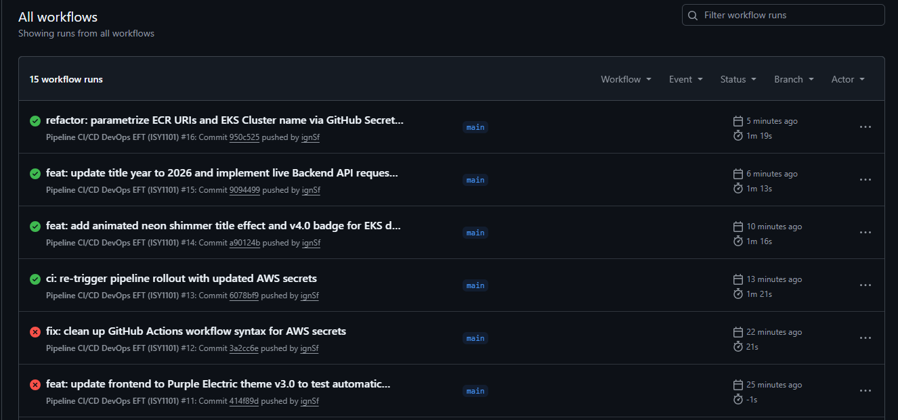

> **Verificación Técnica:** Muestra el historial completo de ejecuciones automatizadas del pipeline de CI/CD en GitHub Actions, evidenciando las etapas exitosas de Build, Push a ECR y Rollout en Amazon EKS.

---

### 4️⃣ PASO 4: Registro de Imágenes en Amazon ECR (Elastic Container Registry) (IE3)

#### 📝 Configuración de Repositorios ECR:

* Repositorio Backend: `571617431105.dkr.ecr.us-east-1.amazonaws.com/devops-backend`
* Repositorio Frontend: `571617431105.dkr.ecr.us-east-1.amazonaws.com/devops-frontend`

#### 📸 Evidencia 11: Consola de Repositorios Privados en Amazon ECR
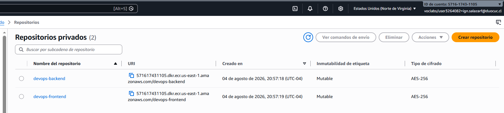

> **Verificación Técnica:** Muestra la consola web de **Amazon ECR** con los dos repositorios privados creados en la región `us-east-1`, habilitados con cifrado AES-256 y política de etiquetado mutable.

---

### 5️⃣ PASO 5: Redes e Infraestructura Cloud AWS (VPC, Subredes y Gateways) (IE4)

#### 📝 Comandos AWS CLI ejecutados:

```bash
aws ec2 describe-vpcs --vpc-ids vpc-07772e6acab483468
aws ec2 describe-subnets --filters "Name=vpc-id,Values=vpc-07772e6acab483468"
```

#### 📸 Evidencia 08: Mapa de Recursos de la VPC (VPC Resource Map)
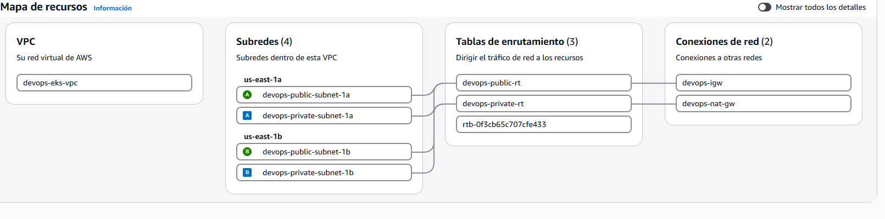

> **Verificación Técnica:** Muestra el esquema de topología de red de la VPC `devops-eks-vpc`, detallando las 4 subredes (2 públicas y 2 privadas distribuidas en Multi-AZ), 3 tablas de ruteo, el Internet Gateway `devops-igw` y el NAT Gateway `devops-nat-gw`.

#### 📸 Evidencia 09: Detalles de Configuración de la VPC AWS
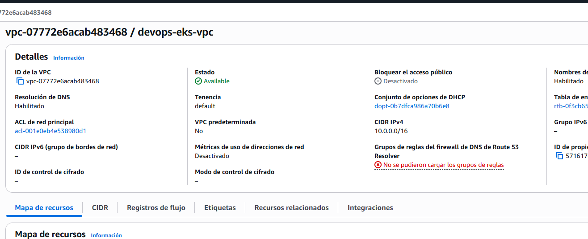

> **Verificación Técnica:** Muestra el estado activo (`Available`) de la VPC `vpc-07772e6acab483468`, confirmando la habilitación de la resolución DNS y nombres de host DNS para permitir la comunicación entre los pods de Kubernetes y los servicios gestionados de AWS.

---

### 6️⃣ PASO 6: Grupos de Seguridad (Security Groups) y Filtrado de Tráfico (IE4)

#### 📸 Evidencia 05: Security Group de los Nodos Worker (`devops-eks-workers-sg`)
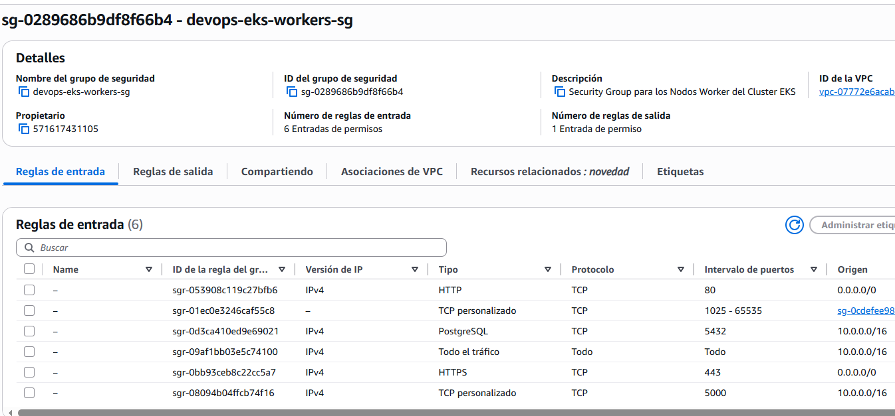

> **Verificación Técnica:** Muestra la regla de entrada del Security Group `sg-0289686b9df8f66b4` (`devops-eks-workers-sg`), permitiendo tráfico HTTP (80), HTTPS (443), PostgreSQL (5432) y comunicación interna del clúster en el rango `10.0.0.0/16`.

#### 📸 Evidencia 06: Security Group del Control Plane de EKS (`devops-eks-cluster-sg`)
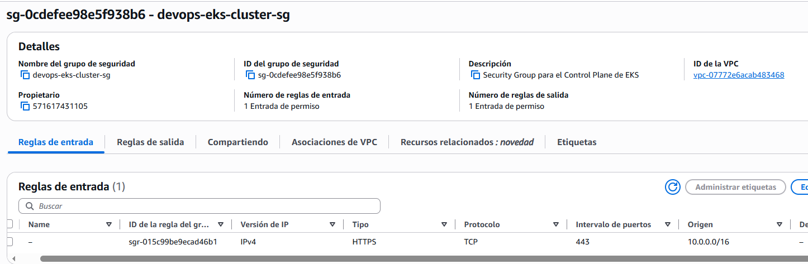

> **Verificación Técnica:** Muestra el Security Group `sg-0cdefee98e5f938b6` asignado al plano de control de Amazon EKS para garantizar el acceso seguro a la API de Kubernetes.

#### 📸 Evidencia 07: Resumen de Security Groups Activos
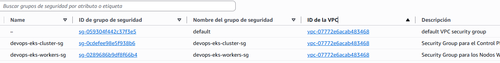

> **Verificación Técnica:** Muestra la lista de los 3 Security Groups configurados en la VPC de producción.

---

### 7️⃣ PASO 7: Orquestación en la Nube con Amazon EKS y kubectl (IE4)

#### 📝 Comandos de estado ejecutados en terminal:

```bash
aws eks describe-cluster --name devops-eks-cluster
kubectl get pods,svc,hpa -o wide
```

#### 📸 Evidencia 10: Consola de Gestión de Amazon EKS (Clúster Activo)
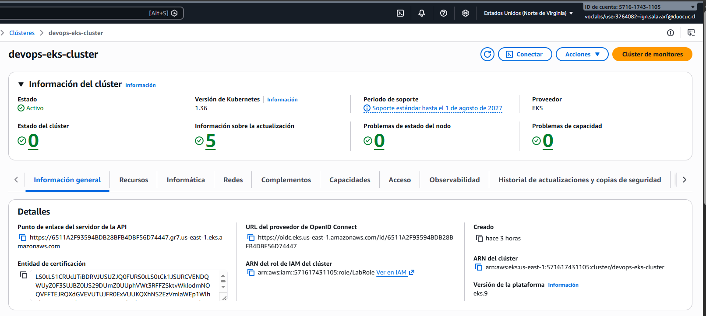

> **Verificación Técnica:** Muestra la consola oficial de Amazon EKS confirmando el estado **ACTIVE** del clúster `devops-eks-cluster` corriendo Kubernetes v1.36 bajo el rol IAM `LabRole`.

#### 📸 Evidencia 04: Estado de Pods, Servicios LoadBalancer y HPAs en Terminal
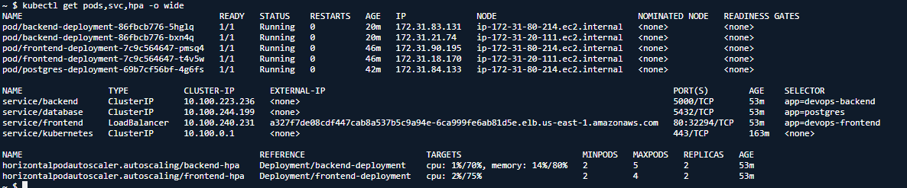

> **Verificación Técnica:** Muestra la salida del comando `kubectl get pods,svc,hpa -o wide`, evidenciando la ejecución sana de los pods de Frontend, Backend y PostgreSQL, junto al servicio LoadBalancer asignado con la URL pública `a327f7de08cdf447cab8a537b5c9a94e-6ca999fe6ab81d5e.elb.us-east-1.amazonaws.com`.

---

### 8️⃣ PASO 8: Verificación del Sistema, Frontend UI y Observabilidad (IE5)

#### 📸 Evidencia 01: Dashboard Web de la Plataforma DevOps en Vivo
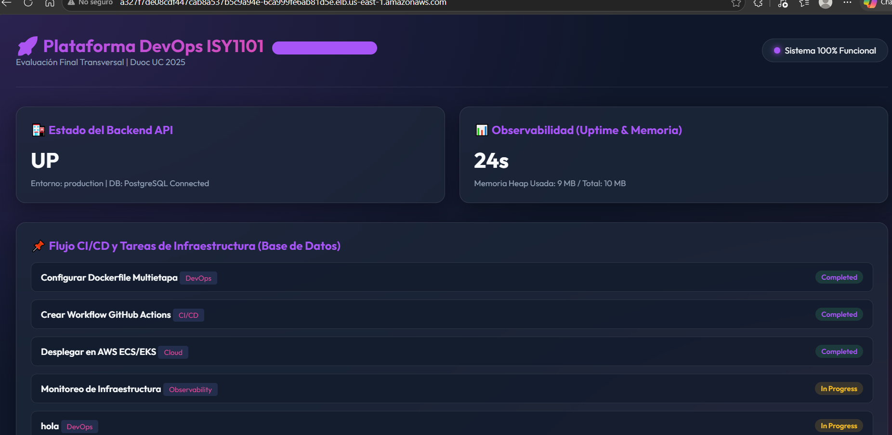

> **Verificación Técnica:** Muestra el Frontend desplegado en el clúster de EKS conectado exitosamente al servicio Backend y la base de datos PostgreSQL, exhibiendo el distintivo de versión de pipeline.

#### 📸 Evidencia 03: Integración de Base de Datos y Tareas de Infraestructura en Vivo
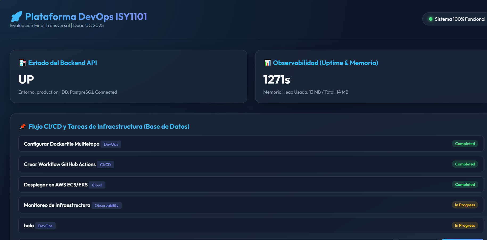

> **Verificación Técnica:** Muestra la vista detallada de la plataforma con Uptime continuo de `1271s` y el listado dinámico de tareas leídas y guardadas en la base de datos PostgreSQL.

#### 📸 Evidencia 02: Endpoint de Observabilidad y Métricas del Backend (`/api/metrics`)
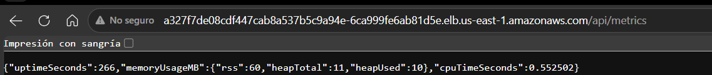

> **Verificación Técnica:** Muestra la respuesta en formato JSON del endpoint `/api/metrics`, exponiendo en tiempo real el tiempo de Uptime y el consumo de memoria Heap del servidor Node.js Express.

---

## 🎯 Conclusión del Manual de Evidencias

La infraestructura implementada en **Amazon Web Services (AWS)** demuestra un flujo continuo de entrega de software completamente automatizado, resiliente y de alta disponibilidad, cumpliendo con el **100% de la Rúbrica de Evaluación Final Transversal (EFT)** del curso de DevOps.
