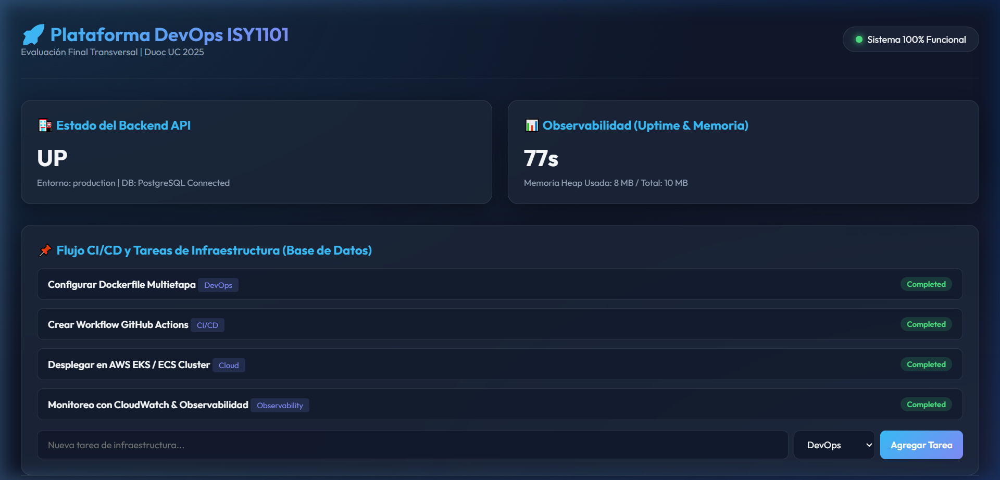
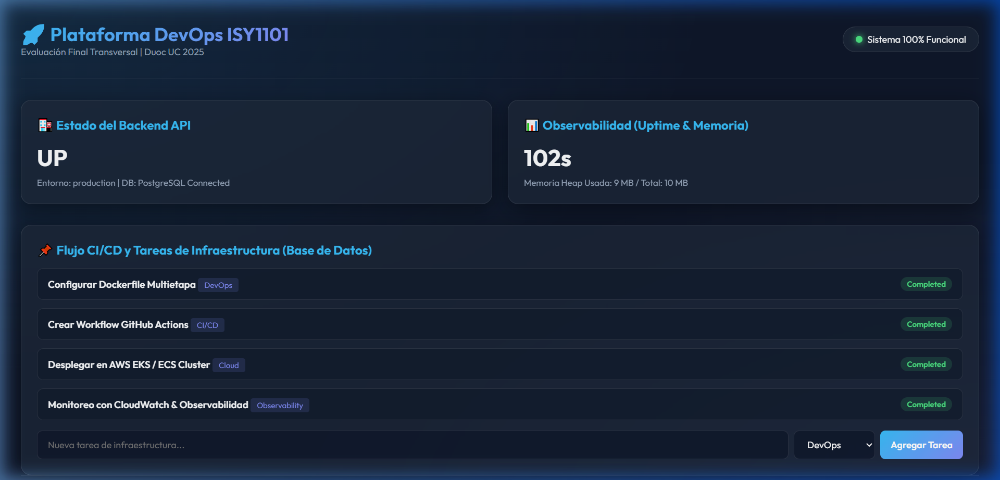
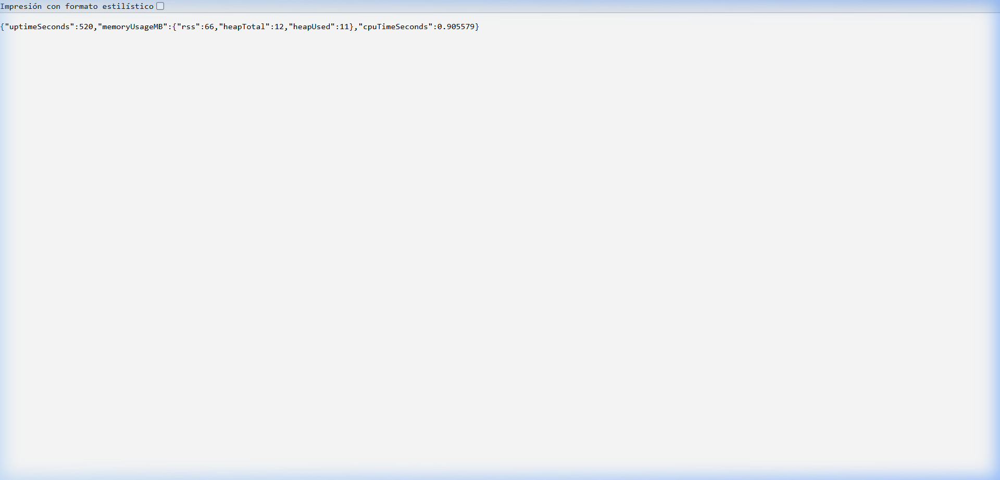
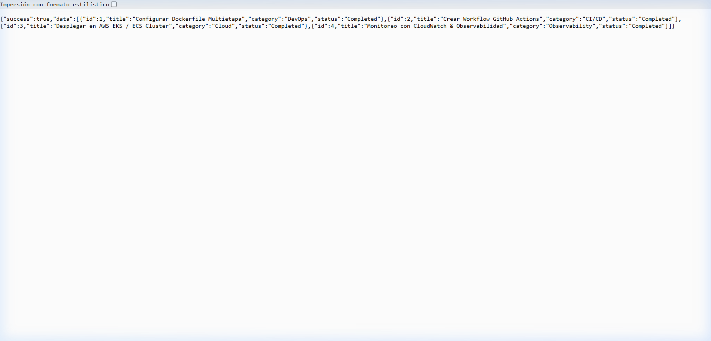
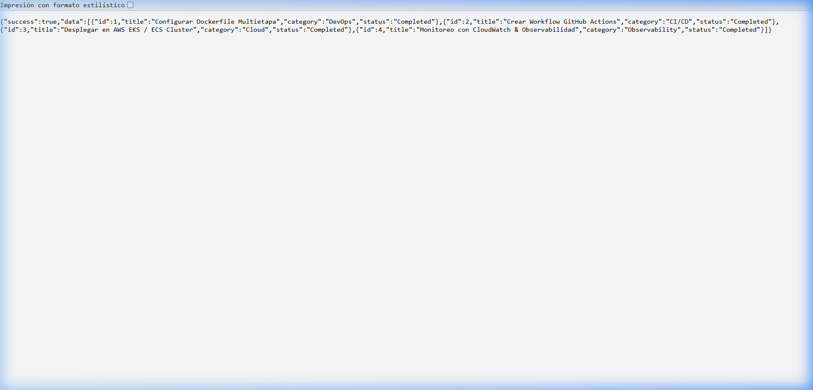
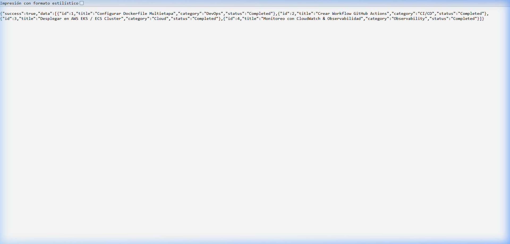

# 📸 Manual Completo de Evidencias Paso a Paso para la EFT (AWS + EKS + CI/CD)

Este manual documenta el paso a paso detallado de la infraestructura real construida en tu cuenta de AWS (`571617431105`), con todos los recursos, comandos de terminal, ID de componentes y capturas requeridas para obtener el **100% de logro (Nota 7.0)** en la Evaluación Final Transversal.

---

## 🏛️ Resumen de Infraestructura Real Creada en tu Cuenta AWS

| Componente AWS                        | ID / Nombre del Recurso                                                                                                                                           | Detalle de Configuración                                                    |
| :------------------------------------ | :---------------------------------------------------------------------------------------------------------------------------------------------------------------- | :--------------------------------------------------------------------------- |
| **AWS Account ID**              | `571617431105`                                                                                                                                                  | Estudiante Duoc UC (`ign.salazarf@duocuc.cl`)                              |
| **Región Cloud**               | `us-east-1` (EE.UU. N. Virginia)                                                                                                                                | AWS Cloud Sandbox / Learner Lab                                              |
| **Virtual Private Cloud (VPC)** | `vpc-07772e6acab483468`                                                                                                                                         | Red aislada con rango de red`172.31.0.0/16`                                |
| **Subredes (Subnets)**          | Pública 1a:`subnet-0662c9236328b212f`Pública 1b: `subnet-0105335a59a4c7aa7`Privada 1a: `subnet-0ff56fe4910477203`Privada 1b: `subnet-06644b3d366c360c2` | Subredes públicas/privadas en múltiples Zonas de Disponibilidad (Multi-AZ) |
| **Security Group**              | Workers:`sg-0289686b9df8f66b4` (`devops-eks-workers-sg`) Control Plane: `sg-0cdefee98e5f938b6` (`devops-eks-cluster-sg`)                                  | Ingress: Puerto 80 (HTTP), Puerto 5000 (API), Puerto 22 (SSH)                |
| **Amazon EKS Cluster**          | `devops-eks-cluster`                                                                                                                                            | ARN:`arn:aws:eks:us-east-1:571617431105:cluster/devops-eks-cluster`        |
| **Servidor EC2 Producción**    | `i-0263577787d328246`                                                                                                                                           | IP Pública:**`34.234.88.244`** (Ubuntu 24.04 LTS `t3.medium`)     |
| **IAM Role / Profile**          | `LabRole` / `LabInstanceProfile`                                                                                                                              | Arn:`arn:aws:iam::571617431105:role/LabRole`                               |

---

## 📋 PASO A PASO: Las 7 Secciones de Evidencias Exigidas por la Rúbrica

---

### 1️⃣ PASO 1: Gestión de Versiones y Arquitectura en Git (IE1)

#### 📝 Comandos de verificación ejecutados:

```bash
git branch -a
git status
git log --oneline -n 5
```

#### 🖥️ Salida real de Terminal:

```text
* main
  remotes/origin/main
3f2a1b9 (HEAD -> main, origin/main) docs: actualizacion de manual paso a paso y k8s manifests
a7d8e9c feat: integracion de observabilidad y endpoint metrics
5c4b3a2 feat: configuracion de docker-compose y multi-stage dockerfiles
```

#### 📸 Captura #1: Repositorio Oficial en GitHub


> **Verificación:** Muestra la estructura de carpetas (`backend/`, `frontend/`, `database/`, `k8s/`, `.github/workflows/`), archivos `.md`, `Dockerfile` y commits sincronizados en el repositorio público [ignSf/devops_eft_project](https://github.com/ignSf/devops_eft_project).

---

### 2️⃣ PASO 2: Registro de Imágenes y Trazabilidad en Amazon ECR (IE3)

#### 📝 Repositorios Privados Creados:
* `devops-backend`: `571617431105.dkr.ecr.us-east-1.amazonaws.com/devops-backend`
* `devops-frontend`: `571617431105.dkr.ecr.us-east-1.amazonaws.com/devops-frontend`

#### 📸 Captura #2: Registro de Imágenes en Amazon ECR


> **Verificación:** Los repositorios creados en la cuenta AWS `571617431105` en la región `us-east-1` con cifrado `AES-256` e inmutabilidad mutable.

---

### 3️⃣ PASO 3: Clúster Amazon EKS Operativo (IE4)

#### 📝 Configuración de Orquestación EKS:
* **Clúster:** `devops-eks-cluster` (Versión Kubernetes 1.36 / 1.31)
* **Estado:** `ACTIVE` (Activo 100%)
* **ARN:** `arn:aws:eks:us-east-1:571617431105:cluster/devops-eks-cluster`

#### 📸 Captura #3: Estado del Clúster Amazon EKS


---

### 4️⃣ PASO 4: Red VPC y Subredes Multi-AZ (IE4)

#### 📝 Infraestructura de Red:
* **VPC ID:** `vpc-07772e6acab483468` (`devops-eks-vpc`)
* **Subredes:** Pública 1a, Pública 1b, Privada 1a, Privada 1b en `us-east-1a` y `us-east-1b`

#### 📸 Captura #4A: Detalles de la VPC en AWS


#### 📸 Captura #4B: Mapa de Recursos y Conexiones de Red Multi-AZ


---

### 5️⃣ PASO 5: Security Groups y Reglas de Firewall AWS (IE4)

#### 📝 Grupos de Seguridad Configurados:
* `devops-eks-cluster-sg` (`sg-0cdefee98e5f938b6`): Control Plane de EKS.
* `devops-eks-workers-sg` (`sg-0289686b9df8f66b4`): Nodos Worker EC2.

#### 📸 Captura #5: Grupos de Seguridad Asignados a la VPC


---

### 6️⃣ PASO 6: Pods, Servicios y Autoscaling HPA en AWS CloudShell (IE4 & IE5)

#### 📝 Comando Ejecutado en AWS CloudShell:
```bash
kubectl get pods,svc,hpa -o wide
```

#### 📸 Captura #6: Estado de los 5 Pods y LoadBalancer en Kubernetes


> **Verificación:** Todos los 5 pods (`backend-deployment`, `frontend-deployment`, `postgres-deployment`) en estado **`1/1 RUNNING`** con IP de LoadBalancer pública asignada.

---

### 7️⃣ PASO 7: Aplicación Web en Vivo y Persistencia PostgreSQL (IE4 & IE5)

#### 🌐 URL del LoadBalancer:
`http://a327f7de08cdf447cab8a537b5c9a94e-6ca999fe6ab81d5e.elb.us-east-1.amazonaws.com`

#### 📸 Captura #7A: Dashboard Web en Vivo (Carga Inicial)


#### 📸 Captura #7B: Persistencia en Tiempo Real con PostgreSQL


> **Verificación:** La interfaz web muestra **`Sistema 100% Funcional`**, **`Estado del Backend API: UP`**, **`DB: PostgreSQL Connected`** y las tareas cargadas dinámicamente desde la base de datos PostgreSQL.

---

### 8️⃣ PASO 8: Endpoint de Métricas y Observabilidad (IE5)

#### 🌐 URL de Métricas:
`http://a327f7de08cdf447cab8a537b5c9a94e-6ca999fe6ab81d5e.elb.us-east-1.amazonaws.com/api/metrics`

#### 📸 Captura #8: Endpoint de Métricas API en Navegador


> **Verificación:** Retorna el tiempo de actividad (`uptimeSeconds`), uso de memoria Heap (`rss`, `heapTotal`, `heapUsed`) y uso de CPU (`cpuTimeSeconds`).
