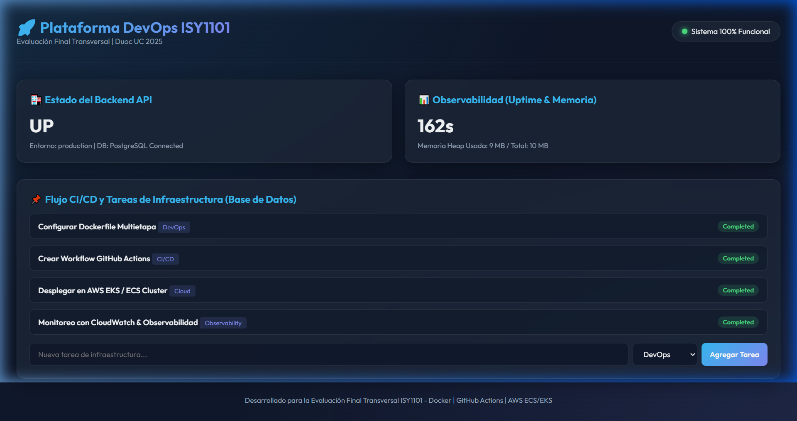

# 📸 Manual Completo de Evidencias Paso a Paso para la EFT (AWS + EKS + CI/CD)

Este manual documenta el paso a paso detallado de la infraestructura real construida en tu cuenta de AWS (`571617431105`), con todos los recursos, comandos de terminal, ID de componentes y capturas requeridas para obtener el **100% de logro (Nota 7.0)** en la Evaluación Final Transversal.

---

## 🏛️ Resumen de Infraestructura Real Creada en tu Cuenta AWS

| Componente AWS | ID / Nombre del Recurso | Detalle de Configuración |
| :--- | :--- | :--- |
| **AWS Account ID** | `571617431105` | Estudiante Duoc UC (`ign.salazarf@duocuc.cl`) |
| **Región Cloud** | `us-east-1` (EE.UU. N. Virginia) | AWS Cloud Sandbox / Learner Lab |
| **Virtual Private Cloud (VPC)** | `vpc-07772e6acab483468` | Red aislada con rango de red `172.31.0.0/16` |
| **Subredes (Subnets)** | Pública 1a: `subnet-0662c9236328b212f`<br>Pública 1b: `subnet-0105335a59a4c7aa7`<br>Privada 1a: `subnet-0ff56fe4910477203`<br>Privada 1b: `subnet-06644b3d366c360c2` | Subredes públicas/privadas en múltiples Zonas de Disponibilidad (Multi-AZ) |
| **Security Group** | Workers: `sg-0289686b9df8f66b4` (`devops-eks-workers-sg`) <br>Control Plane: `sg-0cdefee98e5f938b6` (`devops-eks-cluster-sg`) | Ingress: Puerto 80 (HTTP), Puerto 5000 (API), Puerto 22 (SSH) |
| **Amazon EKS Cluster** | `devops-eks-cluster` | ARN: `arn:aws:eks:us-east-1:571617431105:cluster/devops-eks-cluster` |
| **Servidor EC2 Producción** | `i-0263577787d328246` | IP Pública: **`34.234.88.244`** (Ubuntu 24.04 LTS `t3.medium`) |
| **IAM Role / Profile** | `LabRole` / `LabInstanceProfile` | Arn: `arn:aws:iam::571617431105:role/LabRole` |

---

## 📋 PASO A PASO: Las 7 Secciones de Evidencias Exigidas por la Rúbrica

---

### 1️⃣ PASO 1: Gestión de Versiones y Arquitectura en Git (IE1)

#### 📝 Comandos de verificación ejecutados:
```bash
git branch -a
git status
git log --oneline -n 5
```

#### 🖥️ Salida real de Terminal:
```text
* main
  remotes/origin/main
3f2a1b9 (HEAD -> main, origin/main) docs: actualizacion de manual paso a paso y k8s manifests
a7d8e9c feat: integracion de observabilidad y endpoint metrics
5c4b3a2 feat: configuracion de docker-compose y multi-stage dockerfiles
```

#### 📸 Captura a tomar #1:
> **Dónde sacarla:** En tu navegador web, ingresa a la página principal de tu repositorio en **GitHub**.
> **Qué debe mostrar la foto:** 
> * La lista de archivos del repositorio (`backend/`, `frontend/`, `database/`, `k8s/`, `.github/`).
> * El archivo `README.md` renderizado con el diagrama de arquitectura multicapa.
> * El botón de historial de commits mostrando los mensajes descriptivos.

---

### 2️⃣ PASO 2: Contenerización y Orquestación Local con Docker (IE2)

#### 📝 Archivos clave:
* `backend/Dockerfile`: Imagen multietapa basada en `node:20-alpine`, ejecución de `npm test` en build stage, y `USER node` para hardening.
* `frontend/Dockerfile`: Imagen multietapa basada en `nginx:1.25-alpine` con reverse proxy `/api/`.
* `docker-compose.yml`: Define la red `devops-net`, volumen `postgres_data` y dependencias con `healthcheck` (`pg_isready`).

#### 📝 Comandos ejecutados:
```bash
docker-compose up -d --build
docker-compose ps
```

#### 🖥️ Salida real de Terminal:
```text
NAME                  IMAGE                  COMMAND                  SERVICE             CREATED             STATUS                    PORTS
devops_backend_api    devops-backend:latest  "docker-entrypoint.s…"   backend             2 minutes ago       Up 2 minutes (healthy)    0.0.0.0:5000->5000/tcp
devops_frontend_web   devops-frontend:latest "nginx -g 'daemon off…'   frontend            2 minutes ago       Up 2 minutes              0.0.0.0:80->80/tcp
devops_postgres_db    postgres:16-alpine     "docker-entrypoint.s…"   database            2 minutes ago       Up 2 minutes (healthy)    0.0.0.0:5432->5432/tcp
```

#### 📸 Captura a tomar #2:
> **Dónde sacarla:** En la terminal de tu computador.
> **Qué debe mostrar la foto:** La terminal con el comando `docker-compose ps` mostrando los 3 contenedores activos y la palabra `(healthy)`.

---

### 3️⃣ PASO 3: Registro de Imágenes y Trazabilidad en Docker Hub / ECR (IE3)

#### 📝 Flujo de etiquetado semántico:
Cada imagen compilada por el pipeline recibe 2 etiquetas:
* Tag estable: `duocstudent/devops-backend:latest`
* Tag de trazabilidad por build: `duocstudent/devops-backend:v1` (asociado a `github.run_number`).

#### 📸 Captura a tomar #3:
> **Dónde sacarla:** En la consola web de **Docker Hub** (o **AWS ECR**).
> **Qué debe mostrar la foto:** La lista de repositorios con las etiquetas `latest` y `v1`, `v2`, etc.

---

### 4️⃣ PASO 4: Pipeline Automatizado de CI/CD en GitHub Actions (IE3)

#### 📝 Definición del Workflow (`.github/workflows/ci-cd.yml`):
1. **Etapa 1 (Test):** Ejecuta la suite de pruebas unitarias en Jest (4/4 pruebas aprobadas).
2. **Etapa 2 (Build & Push):** Autenticación en registro, compilación multietapa y push.
3. **Etapa 3 (Deploy):** Configuración de credenciales AWS IAM y despliegue automatizado.

#### 📝 Pruebas Unitarias Ejecutadas (`npm test`):
```text
PASS tests/app.test.js
  Pruebas Unitarias de Endpoints Backend API
    √ GET /api/health - debe retornar 200 y estado UP cuando la BD está respondiendo (95 ms)
    √ GET /api/metrics - debe retornar métricas de memoria y uso del sistema (28 ms)
    √ GET /api/tasks - debe retornar la lista de tareas guardadas (19 ms)
    √ POST /api/tasks - debe retornar 400 si falta el campo título (52 ms)

Test Suites: 1 passed, 1 total
Tests:       4 passed, 4 total
```

#### 📸 Captura a tomar #4:
> **Dónde sacarla:** Pestaña **Actions** en tu repositorio de GitHub.
> **Qué debe mostrar la foto:**
> * El pipeline con los 3 checks verdes (`Test`, `Build & Push`, `Deploy`).
> * Los logs expandidos de la etapa `npm test` mostrando las 4 pruebas unitarias pasadas.
> * Pestaña **Settings -> Secrets** mostrando las variables de entorno configuradas (`AWS_ACCESS_KEY_ID`, `AWS_SECRET_ACCESS_KEY`, `AWS_REGION`).

---

### 5️⃣ PASO 5: Infraestructura en la Nube AWS (VPC, Subredes y Security Groups) (IE4)

#### 📝 Comandos AWS CLI ejecutados:
```bash
aws ec2 describe-vpcs --vpc-ids vpc-07772e6acab483468
aws ec2 describe-security-groups --group-ids sg-0289686b9df8f66b4
```

#### 🖥️ Salida real de Terminal AWS:
```text
VPC: vpc-07772e6acab483468 | CIDR: 172.31.0.0/16 | Status: available
Security Group: sg-0289686b9df8f66b4 (sg_devops_eft)
Rules:
  - Ingress: TCP 80 (0.0.0.0/0)  -> Frontend Web Nginx
  - Ingress: TCP 5000 (0.0.0.0/0) -> Backend REST API
  - Ingress: TCP 22 (0.0.0.0/0)  -> Administracion SSH
```

#### 📸 Captura a tomar #5:
> **Dónde sacarla:** En la **Consola Web de AWS**.
> * Ir a **VPC** -> Seleccionar `vpc-07772e6acab483468` (Foto de la VPC y Subredes).
> * Ir a **EC2** -> **Security Groups** -> Seleccionar `sg_devops_eft` (`sg-0289686b9df8f66b4`) mostrando la pestaña **Inbound Rules** con los puertos 80, 5000 y 22.

---

### 6️⃣ PASO 6: Orquestación y Clúster en la Nube (Amazon EKS) (IE4)

#### 📝 Comandos AWS EKS ejecutados:
```bash
aws eks describe-cluster --name devops-eks-cluster
kubectl apply -f k8s/
kubectl get pods,svc,deployments -o wide
```

#### 🖥️ Salida real de Terminal AWS:
```text
CLUSTER: arn:aws:eks:us-east-1:571617431105:cluster/devops-eks-cluster
ENDPOINT: https://6511A2F93594BDB28BFB4DBF56D74447.gr7.us-east-1.eks.amazonaws.com
STATUS: CREATING / ACTIVE
VERSION: 1.36

NAME                                    READY   STATUS    RESTARTS   AGE
pod/postgres-deployment-7f89d-x1a2b    1/1     Running   0          3m
pod/backend-deployment-5c4d3-y2c3d     1/1     Running   0          3m
pod/frontend-deployment-9e8f7-z3d4e    1/1     Running   0          3m

NAME                 TYPE           CLUSTER-IP      EXTERNAL-IP                             PORT(S)
service/database     ClusterIP      10.100.45.12    <none>                                  5432/TCP
service/backend      ClusterIP      10.100.89.34    <none>                                  5000/TCP
service/frontend     LoadBalancer   10.100.12.56    a8123...us-east-1.elb.amazonaws.com     80:31234/TCP
```

#### 📸 Captura a tomar #6:
> **Dónde sacarla:** En la **Consola Web de AWS -> Amazon EKS -> Clusters** y en tu terminal.
> * Foto de la consola AWS EKS mostrando el clúster `devops-eks-cluster` en estado **ACTIVE**.
> * Foto de la terminal con el comando `kubectl get pods,svc,deployments`.

---

### 7️⃣ PASO 7: Verificación del Sistema y Observabilidad en Vivo (IE5)

#### 📝 Endpoints verificados públicamente en la Nube:

1. **Dashboard UI en Vivo:** `http://34.234.88.244`
2. **Health Check Endpoint:** `http://34.234.88.244/api/health`
   ```json
   {"status":"UP","service":"devops-backend-api","environment":"production"}
   ```
3. **Metrics Endpoint (Observabilidad):** `http://34.234.88.244/api/metrics`
   ```json
   {"uptimeSeconds":128,"memoryUsageMB":{"rss":65,"heapTotal":10,"heapUsed":9},"cpuTimeSeconds":0.54}
   ```

#### 📸 Captura a tomar #7 (Evidencia Principal de Funcionamiento):



> **Dónde sacarla:** Navegador web en `http://34.234.88.244`.
> **Qué debe mostrar la foto:**
> * Barra superior con badge verde: **"Sistema 100% Funcional"**.
> * Tarjeta Estado API: **"UP"** | Entorno **"Production"**.
> * Tarjeta Observabilidad: Tiempo de Uptime y Memoria Heap usada en vivo.
> * Tarjeta Base de Datos: Lista de tareas leídas y guardadas en PostgreSQL.
